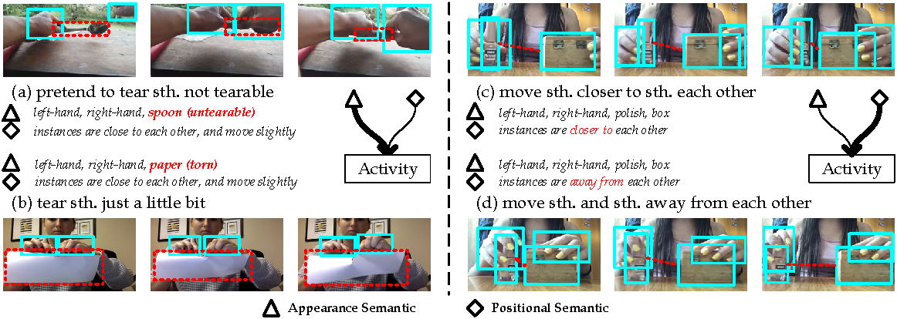
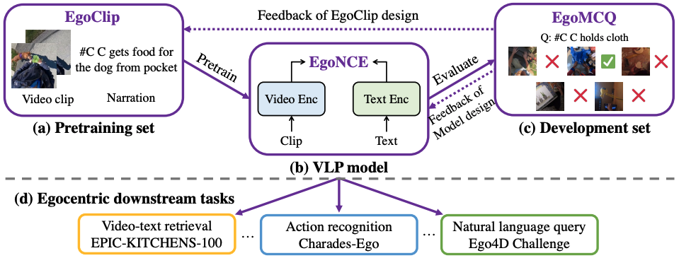
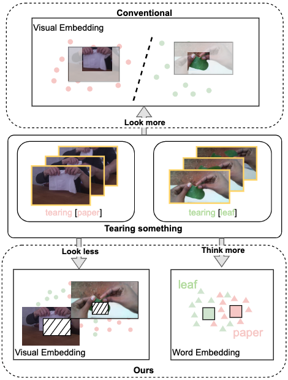
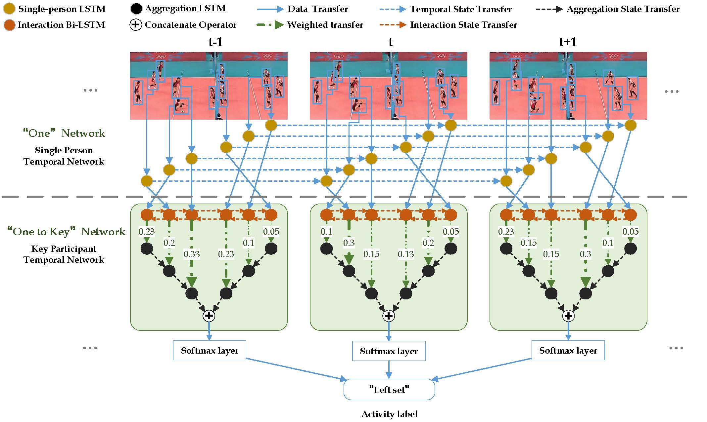








#  Intro 

I am currently a Professor in Intelligent Media Analysis Group (<a href="https://imag-njust.net">IMAG</a>), 
		at School of Computer Science and Engineering, Nanjing University of Science and Technology, China. 
		From Mar. 2023 to Apr. 2025, I was an Assistant Researcher of Department of Computer Science and Technology at Nanjing University 
		and working with <a href="https://scholar.google.com/citations?user=W-FGd_UAAAAJ&hl=en">Tieniu Tan</a>.
		I obtained Ph.D. degree from Nanjing University of Science and Technolog, under the supervision of Prof. <a href="https://imag-njust.net/jinhui-tang">Jinhui Tang</a>, in Nov. 2022. 
		From Jan. 2022 to Aug. 2022, I worked as a Research Intern (Part-time) at ByteDance. 
		From Sep. 2021 to Dec. 2021, I worked as a Research Intern (Part-time) at Tencent with <a href="https://geyixiao.com/">Yixiao Ge</a>. 
		From Dec. 2018 to Dec. 2019, I worked as a Research Intern at <a href="http://www.noahlab.com.hk/">HUAWEI NOAH'S ARK LAB</a> with <a href="http://lingxixie.com/Home.html">Lingxi Xie</a> and Prof. <a href="https://scholar.google.com/citations?user=61b6eYkAAAAJ&hl=en">Qi Tian</a> (IEEE Fellow). 
		I am working closely with <a href="http://www.columbia.edu/~zs2262/">Mike Shou</a> and <a href="https://imag-njust.net/xiangboshu">Xiangbo Shu</a>. 
		My research mainly focus on Video Understanding and Multimodal Understanding.

#  Researh Interests 

Video Understanding, Human Behavior Analysis, Embodied Intelligence and other related human-centric problems in Artificial Intelligence, Computer Vision and Multimedia.

 

<i style="font-family: Roboto;">*Positions for Interns/Master/PhD's Programme*</i>
 
 <i style="font-family: Roboto;">We are looking for students, who are self-motivated and have a solid foundation in mathematics and programming. If you are interested, please feel free to contact us!.</i>

#  News 
- 2025.12: Two paper is accepted by IEEE TCSVT.
- 2025.9: One paper is accepted by NeurIPS 2025.
- 2025.7: One paper is accepted by ICCV 2025.
- 2025.4: Two papers is accepted by IJCAI 2025.
- 2025.1: One paper is accepted by ICLR 2025.
- 2024.12: One paper is accepted by IEEE TMM.
- 2024.7: Two papers is accepted by ACM MM 2024.
- 2024.7: One paper is accepted by IEEE TMM.
- 2024.4: One paper is accepted by IEEE TCSVT.
- 2024.2: One paper is accepted by IJCAI 2024.
- 2023.12: One paper is accepted by IEEE TIP.
- 2023.6: Four paper is accepted by ACM MM 2023.
- 2023.6: One paper is accepted by ICCV 2023.
- 2023.5: One paper is accepted by IEEE TCSVT.
- 2023.3: One paper is accepted by IEEE TPAMI.
- 2023.2: One paper is accepted by CVPR 2023.
- 2022.11: One paper is accepted by AAAI 2023.
- 2022.09: One paper is accepted by NeurIPS 2022.
- 2022.07: One paper is accepted by ACM MM 2022.
- 2022.06: Our team achieves the First Place Award in Object State Change Classification Track, the Second Place Award in Natural Language Queries for Episodic Memory Track, and the Third Place Award in PNR Temporal Localization Track of EGO4D Challenge (CVPR 2022).
- 2022.06: Our team achieves the First Place Award in Multi-Instance Action Retrieval Track of EPIC-Kitchens Dataset Challenges (CVPR 2022).
- 2022.03: Two papers are accepted by CVPR 2022.
- 2022.01: One paper is accepted by IEEE TCSVT.
- 2021.12: I give a talk about Video-Language Pre-training at PCG, Tencent.
- 2021.08: I will work with Prof. Mike Shou at Show Lab, National University of Singapore.
- 2020.05.19: One paper is accepted by IEEE TNNLS.
- 2020.12.08: One paper is accepted by ACM MM Asia 2020.
- 2020.10.20: One paper is accepted by IEEE TPAMI.
- 2020.07.03: One paper is accepted by ECCV 2020.
- 2020.05: Selected as the Outstanding PhD of NJUST.
- 2019.05: I give a talk about GAR at the Noah's Ark Lab, Huawei Inc.

#  Selected Publications 

<table align="center" border="none">
 <tr>
      <td>
        
      </td>
      <td>
        

        <b>Vision-centric Token Compression in Large Language Model</b> 
			Ling Xing, Alex Jinpeng Wang, <b>Rui Yan*</b>, Xiangbo Shu, Jinhui Tang 
			NeurIPS (Spotlight), 2025  [<a href="https://arxiv.org/pdf/2502.00791">PDF</a>] [<a href="https://mp.weixin.qq.com/s?__biz=MzI3MTA0MTk1MA==&mid=2652640763&idx=2&sn=c0463cd8c62f5e29feac45a00747b02c&chksm=f012aaeac6a0ec6048752f3f6c27d9b87881a843c0786d78e3100e5facbcdb07ce6a86bb2a33&scene=0&xtrack=1">新智元</a>]
        

      </td>
    </tr>
 <tr>
      <td>
        
      </td>
      <td>
        

       <b>V-MAGE: A Game Evaluation Framework for Assessing Visual-Centric Capabilities in Multimodal Large Language Models</b> 
			Xiangxi Zheng, Linjie Li, Zhengyuan Yang, Ping Yu, Alex Jinpeng Wang, <b>Rui Yan</b>, Yuan Yao, Lijuan Wang 
			arxiv, 2025 [<a href="https://arxiv.org/pdf/2504.06148">PDF</a>]
        

      </td>
    </tr>
    <tr>
      <td>
        
      </td>
      <td>
        

       <b> TEST-V: TEst-time Support-set Tuning for Zero-shot Video Classification</b> 
			<b>Rui Yan</b>, Jin Wang, Hongyu Qu, Xiaoyu Du, Dong Zhang, Jinhui Tang, Tieniu Tan 
			IJCAI, 2025 [<a href="https://arxiv.org/pdf/2502.00426">PDF</a>]
        

      </td>
    </tr>
    <tr>
      <td>
        
      </td>
      <td>
        

        <b>DTS-TPT: Dual Temporal-Sync Test-time Prompt Tuning for Zero-shot Activity Recognition</b> 
			<b>Rui Yan</b>, Hongyu Qu, Xiangbo Shu, Wenbin Li, Jinhui Tang, Tieniu Tan 
	    IJCAI, 2024  [<a href="https://www.ijcai.org/proceedings/2024/0170.pdf">PDF</a>]
        

      </td>
    </tr>
	<tr>
      <td>
        
      </td>
      <td>
        

        <b>Progressive Instance-aware Feature Learning for Compositional Action Recognition</b> 
			<b>Rui Yan</b>, Lingxi Xie, Xiangbo Shu, Liyan Zhang, and Jinhui Tang 
	   TPAMI, 2023 [<a href="https://arxiv.org/pdf/2012.05689">PDF</a>][<a href="https://github.com/ruiyan1995/Interactive_Fusion_for_CAR">Code</a>]
        

      </td>
    </tr>
	<tr>
      <td>
        
      </td>
      <td>
        

        <b>All in One: Exploring Unified Video-language Pre-training</b> 
			Jinpeng Wang, Yixiao Ge, <b>Rui Yan</b>, Xudong Lin, Guanyu Cai, Jianping Wu, Ying Shan, Xiaohu Qie, Mike Zheng Shou 
	   CVPR 2023 [<a href="https://arxiv.org/abs/2203.07303">PDF</a>][<a href="https://github.com/showlab/all-in-one">Code</a>]
        

      </td>
    </tr>
	<tr>
      <td>
        
      </td>
      <td>
        

        <b>Video-Text Pre-training with Learned Regions for Retrieval</b> 
			<b>Rui Yan</b>, Mike Zheng Shou, Yixiao Ge, Alex Jinpeng Wang, Xudong Lin, Guanyu Cai, and Jinhui Tang 
	   AAAI 2023 [<a href="https://arxiv.org/pdf/2112.01194">PDF</a>][<a href="https://github.com/ruiyan1995/Region_Learner">Code</a>]
        

      </td>
    </tr>
   <tr>
      <td>
        
      </td>
      <td>
        

        <b>Egocentric Video-Language Pretraining</b> 
			Kevin Qinghong Lin, Alex Jinpeng Wang, Mattia Soldan, Michael Wray, <b>Rui Yan</b>, Eric Zhongcong Xu, Difei Gao, Rongcheng Tu, Wenzhe Zhao, Weijie Kong, Chengfei Cai, Hongfa Wang, Dima Damen, Bernard Ghanem, Wei Liu, Mike Zheng Shou 
	NeurIPS 2022 (Spotlight) [<a href="https://arxiv.org/pdf/2206.01670">PDF</a>][<a href="https://github.com/showlab/EgoVLP">Code</a>]
        

      </td>
    </tr>
	<tr>
      <td>
        
      </td>
      <td>
        

        <b>Look Less Think More: Rethinking Compositional Action Recognition</b> 
			<b>Rui Yan</b>, Peng Huang, Xiangbo Shu, Junhao Zhang, Yonghua Pan, Jinhui Tang 
	   ACM MM 2022 [<a href="https://dl.acm.org/doi/abs/10.1145/3503161.3547862">PDF</a>][<a href="https://drive.google.com/file/d/1UawPdVymHlfl2C9sAtUWmTri529jM7oV/view?usp=share_link">Split</a>]
        

      </td>
    </tr>
	<tr>
      <td>
        
      </td>
      <td>
        

        <b>Dual-AI: Dual-path Actor Interaction Learning for Group Activity Recognition</b> 
			Mingfei Han, David Junhao Zhang, Yali Wang, <b>Rui Yan</b>, Lina Yao, Xiaojun Chang, and Yu Qiao 
	  CVPR 2022 (Oral) [<a href="https://openaccess.thecvf.com/content/CVPR2022/papers/Han_Dual-AI_Dual-Path_Actor_Interaction_Learning_for_Group_Activity_Recognition_CVPR_2022_paper.pdf">PDF</a>]
        

      </td>
    </tr>
		<tr>
      <td>
        
      </td>
      <td>
        

        <b>HiGCIN: Hierarchical Graph-based Cross Inference Network for Group Activity Recognition</b> 
			<b>Rui Yan</b>, Lingxi Xie, Jinhui Tang, Xiangbo Shu, and Qi Tian 
	 TPAMI, 2020 [<a href="https://ieeexplore.ieee.org/stamp/stamp.jsp?tp=&arnumber=9241410">PDF</a>][<a href="https://github.com/ruiyan1995/HiGCIN">Code</a>]
        

      </td>
    </tr>
		<tr>
      <td>
        
      </td>
      <td>
        

        <b>Adaptive Module for Weakly-supervised Group Activity Recognition</b> 
			<b>Rui Yan</b>, Lingxi Xie, Jinhui Tang, Xiangbo Shu, and Qi Tian 
	  ECCV 2020 [<a href="https://arxiv.org/pdf/2007.09470">PDF</a>][<a href="SAM.html">Project</a>][<a href="https://github.com/ruiyan1995/Weakly-supervised-Group-Activiy-Recognition">Code</a>]
        

      </td>
    </tr>
		<tr>
      <td>
        
      </td>
      <td>
        

        <b>Coherence Constrained Graph LSTM for Group Activity Recognition</b> 
			Jinhui Tang, Xiangbo Shu, <b>Rui Yan</b>, and Liyan Zhang 
	  TPAMI, 2019
        

      </td>
    </tr>
		<tr>
      <td>
        
      </td>
      <td>
        

        <b>Participation-Contributed Temporal Dynamic Model for Group Activity Recognition</b> 
			<b>Rui Yan</b>, Jinhui Tang, Xiangbo Shu, Zechao Li and Qi Tian 
	 ACM MM 2018 (Oral) ~8.5% (Journal version is accepted by TNNLS)  
			[<a href="https://www.researchgate.net/profile/Rui_Yan31/publication/328372578_Participation-Contributed_Temporal_Dynamic_Model_for_Group_Activity_Recognition/links/5bed27684585150b2bb79e69/Participation-Contributed-Temporal-Dynamic-Model-for-Group-Activity-Recognition.pdf">PDF</a>][<a href="https://github.com/ruiyan1995/Group-Activity-Recognition">Code</a>][<a href="https://github.com/ruiyan1995/ruiyan1995.github.io/raw/master/mm2018_korea.pptx">Slides</a>]
        

      </td>
    </tr>
</table>
For more papers, please kindly refer to <a href="https://scholar.google.com.hk/citations?user=PWy5LfMAAAAJ&hl=zh-CN&oi=ao">my Google Scholar page</a>

#  Honors and Awards 
- 江苏省科学技术一等奖（排4），江苏省政府，2024
- 中国图象图形学学会(CSIG)-优博，中国图象图形学学会，2024
- 江苏省青年科技人才托举工程， 江苏省科协，2024
- 江苏省计算机学会-优博，江苏省计算机学会，2024
- 校优秀博士论文，南京理工大学，2024
- 国家资助博士后，中国博士后科学基金会，2023
- 中国博士后科学基金特别资助，中国博士后科学基金会，2023
- 江苏省卓越博士后，江苏省人社厅，2023
- 新城市教育基金-后备学科带头人奖，南京理工大学，2026
- 毓秀青年学者，南京大学，2023

#  Grants 
- 国家自然科学基金面上项目, 2025.1-2028.12
- 国家自然科学基金青年科学基金项目, 2024.1-2024.12
- 国家资助博士后项目, 2023-2025
- 中国博士后科学基金第73批面上资助, 2023-2025
<!-- - 中国博士后科学基金特别资助, 2023-2025 -->
<!-- - 江苏省卓越博士后资助, 2023-2025 -->
- 南京理工大学科研启动经费, 2025
- 中央高校基本科研业务费-揭榜挂帅, 2023/2024
<!-- - 中央高校基本科研业务费-揭榜挂帅, 2024 -->

#  Academic Service 
- 中国图像图形学会多媒体专业委员会委员（CSIG-MM）
- 中国计算机学会计算机视觉专业委员会委员（CCF-CV）
- TPC for CVPR/ICCV/ECCV/NeurIPS/AAAI/IJCAI/MM, TPAMI/TIP/TNNLS/TIFS/TMM/TCSVT/TOMM/PR/Neurocomputing/Information Sciences.

<!-- IEEE Transactions on Pattern Analysis and Machine Intelligence (TPAMI)
IEEE Transactions on Image Processing (TIP)
IEEE Transactions on Neural Networks and Learning Systems (TNNLS)
IEEE Transactions on Information Forensics and Security (TIFS)
IEEE Transactions on Multimedia (TMM)
IEEE Transactions on Circuits and Systems for Video Technology (TCSVT)
ACM Transactions on Multimedia Computing, Communications, and Applications (TOMM)
Pattern Recognition (PR)
Neurocomputing
Information Sciences

IEEE/CVF Conference on Computer Vision and Pattern Recognition（CVPR）
IEEE/CVF International Conference on Computer Vision（ICCV）
European Conference on Computer Vision（ECCV）
Conference on Neural Information Processing Systems（NeurIPS）
AAAI Conference on Artificial Intelligence（AAAI）
International Joint Conference on Artificial Intelligence（IJCAI）
ACM International Conference on Multimedia（MM） -->

<!-- - The Outstanding PhD of Nanjing University of Science and Technology 2020
- ACM Multimedia Student Travel Grant 2018
- The First Prize Scholarship of Nanjing University of Science and Technology 2017, 2018
- Excellent Undergraduate Thesis of Jiangsu Province 2018
- Top Ten Outstanding Youth of Nanjing Forestry University 2017
- The Second prize of National University Students Computer Design Competition 2016
- The National Encouragement Scholarship 2014, 2015, 2016
- Merit Student of Nanjing Forestry University 2014, 2015, 2016 -->